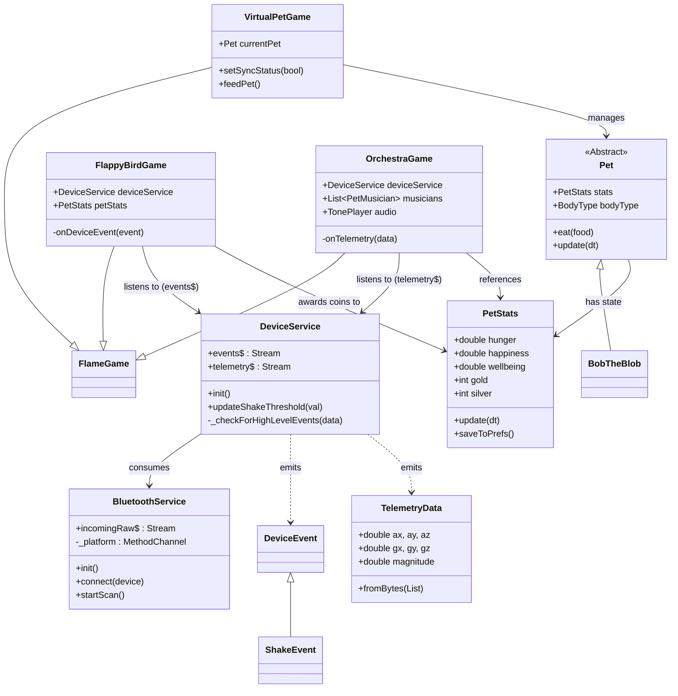

# Therapets (Sync Companion)

A Flutter-based virtual pet app that uses a custom BLE hardware companion (M5-IMU-Sensor) to bring your pet to life through motion controls and real-time telemetry.

## Architecture



### Service Layer
| Service | Role | Output |
|---------|------|--------|
| `BluetoothService` | Low-level BLE manager (scan, connect, foreground service) | `incomingRaw$` (bytes) |
| `DeviceService` | High-level abstraction (parses bytes, detects gestures) | `telemetry$` (sensor data), `events$` (ShakeEvent, etc.) |

### Game Layer (Flame Engine)
| Component | Description |
|-----------|-------------|
| `VirtualPetGame` | Main screen. Renders the pet (`BobTheBlob`) and manages sync status. |
| `Pet` / `PetStats` | Tamagotchi-style logic: hunger, happiness, currency, persistence. |
| `FlappyBirdGame` | Action game. Listens to **discrete events** (`ShakeEvent`) to jump. Awards Silver coins. |
| `OrchestraGame` | Creative tool. Listens to **continuous telemetry** to map tilt to pitch/volume. |

## Project Structure
```
lib/
├── main.dart               # App entry point
├── services/
│   ├── bluetooth_service.dart   # Low-level BLE
│   └── device_service.dart      # High-level device abstraction
├── game/
│   ├── virtual_pet_game.dart    # Main pet game
│   ├── bob_the_blob.dart        # Pet implementation
│   ├── pets/                    # Pet base classes & stats
│   └── minigames/
│       ├── flappy_bird/         # Flappy Bird minigame
│       └── orchestra/           # Pet Orchestra minigame
└── screens/                     # Flutter UI screens
```

## Quick Start
```powershell
flutter pub get
flutter run -d <device-id>
```

## Development Status

### Current Stage: Stage 3 — Telemetry Minigames
- [x] Game Framework (modular minigame screens)
- [x] Input Hook (low-latency sensor data binding)
- [x] Flappy Bird (shake to jump)
- [x] Pet Orchestra (tilt to conduct)

### Stage History
| Stage | Focus | Status |
|-------|-------|--------|
| 1 | **Connectivity** — Background BLE stability | ✅ Complete |
| 2 | **Virtual Pet Base** — Hunger, Happiness, Currency | ✅ Complete |
| 3 | **Telemetry Minigames** — Motion-controlled games | 🚧 In Progress |
