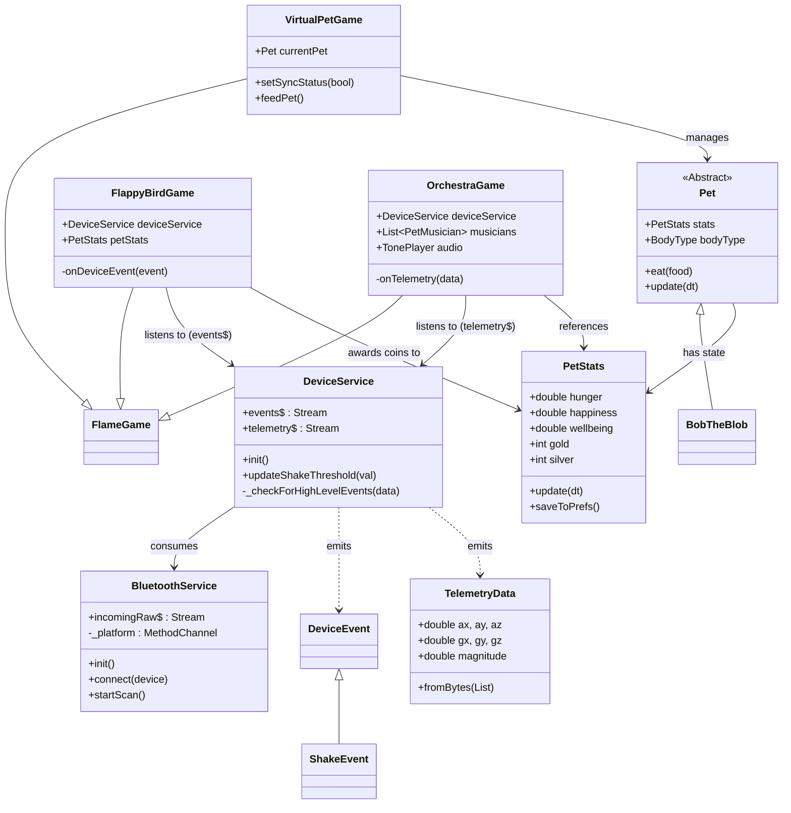

# System Architecture

## Overview
The application is a Flutter-based virtual pet game that acts as a visual companion for a custom BLE hardware device ("Sync Companion"). The architecture follows a layered approach, separating hardware communication (Services) from business logic and rendering (Game).

## Class Diagram

## Core Components

### 1. Service Layer (Hardware Inteface)
The service layer bridges the gap between the physical BLE device and the application.

*   **`BluetoothService` (`lib/services/bluetooth_service.dart`)**:
    *   **Role**: Low-level BLE manager.
    *   **Responsibilities**: Handles scanning (`startScan`), connecting (`connect`), and raw byte streams. It communicates with a native platform channel (`MethodChannel`) to potentially keep the connection alive via a foreground service on Android/iOS.
    *   **Output**: Stream of raw bytes (`incomingRaw$`).

*   **`DeviceService` (`lib/services/device_service.dart`)**:
    *   **Role**: High-level Domain Abstraction.
    *   **Responsibilities**: Consumes `BluetoothService` and sanitizes the data. It parses raw bytes into `TelemetryData` (accelerometer/gyroscope values) and detects meaningful gestures (like "Shake").
    *   **Output**: 
        *   `telemetry$`: Continuous stream of sensor data.
        *   `events$`: Discrete high-level events (e.g., `ShakeEvent`) that games can react to.

### 2. Game Layer (Logic & Rendering)
The game layer uses the Flame engine to render the pet and minigames.

*   **`VirtualPetGame` (`lib/game/virtual_pet_game.dart`)**:
    *   **Role**: The main application container and "Home Screen".
    *   **Responsibilities**: Renders the pet (`BobTheBlob`), passes sync status from the services to the pet, and persists state.

*   **`Pet` & `PetStats` (`lib/game/pets/`)**:
    *   **`Pet`**: The visual entity (Sprite). Handles animations and eating logic.
    *   **`PetStats`**: The "Tamagotchi" logic (Hunger, Happiness, Currency). It handles logic like "happiness decays if not synced" and persists data to SharedPreferences.

*   **Minigames**:
    *   **`FlappyBirdGame`**: An action game that listens to **discrete events** (`events$`, e.g., "Shake") to trigger jumps. It awards Silver coins.
    *   **`OrchestraGame`**: A creative tool that listens to **continuous telemetry** (`telemetry$`) to map device tilt to pitch and volume. It allows the user to "conduct" a choir of pets.

## Data Flow Examples

### 1. Motion Control (Discrete Event - Flappy Bird)
1.  **Hardware**: User shakes the device. M5-IMU-Sensor sends 12 bytes.
2.  **DeviceService**: Parses bytes, detects magnitude > threshold, emits `ShakeEvent`.
3.  **FlappyBirdGame**: Receives `ShakeEvent`, triggers `flap()`.

### 2. Conducting (Continuous Stream - Orchestra)
1.  **Hardware**: User tilts the device. Sensor sends bytes continuously.
2.  **DeviceService**: Parses bytes, emits `TelemetryData` every packet.
3.  **OrchestraGame**: 
    *   Receives `TelemetryData` (accelerometer X/Y).
    *   Smooths the values.
    *   Maps **X-axis** to **Pitch** (Low <-> High).
    *   Maps **Y-axis** to **Volume** (Quiet <-> Loud).
    *   Updates the `TonePlayer` frequency/gain and musician animations in real-time.
